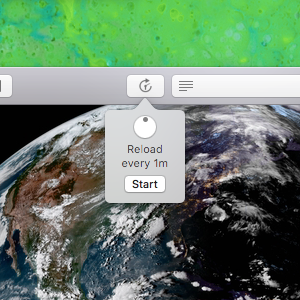

Auto Reload
===========

Auto Reload is a Safari extension for automatically refreshing browser windows with recurring timers.
The goal with this implementation is to provide functionality with as few "add-on" side effects as possible. 
There's no javascript injection, no security permissions required, and the UI is entirely default controls. 
The extension ships inside a basic Mac app with a single view providing instructions for enabling in Safari. 
This app is purely a wrapper and does not communicate with the extension itself.

The app/extension is available for $.99 in the [Mac App store](https://apps.apple.com/us/app/auto-reload/id1437349439). 
My commitment to customers there is to keep up a stable version built for current MacOS and Safari. 

During my time developing this project I've learned that auto refreshing is more nuanced than one might think. 
How accurate should the timers be? 
What does power and resource management think about what's going on? (hint, they're not happy usually) 
What granularity of time interval do users need and/or want?

Along the way I've made a lot of assumptions catering to my personal use case, turning build dashboards into digital signs.
Digital signs are not useful if they crash, so stability is the top priority.
I also feel some obligation as a webmaster to not enable the wholesale DoS-ing of websites with sub-second system timers.
That said, I also enjoy some good ol' fashioned hacking with web scripts on intervals.
Auto-refresh can be auto-webhook, and one can do some very cool stuff; very quickly.
It has been eye-opening how many awesome people also enjoy responsibly abusing Auto Reload for science and engineering.
Thank you for your app reviews and emails. Praise or scorn, I love reading how people are using the code.

To help those who would like to push the limits or customize the software for other use cases the code is now available under MIT license.
Pull requests in the spirit of project goals will be reviewed, tested, and appreciated. 
Advanced features should be implemented in a fork. 
I wholeheartedly endorse others profiting from this code.
Please switch out the name, icons and other graphic assets before redistribution.

-Garrett Johnson

Support
-------

Feel free to create a GitHub issue for feature ideas, help with using the extension, or just to give feedback and let me know how you're using Auto Reload.

Getting Started
---------------

Requires Xcode with command line tools. Prepare by uninstalling existing versions of Auto Reload.

1. Fork GitHub code. Clone to your local computer.
2. Drag checked out directory to Xcode
3. Build and run the _application_ then the _extension_

----------------------------------
Copyright (c) 2020 Garrett Johnson
