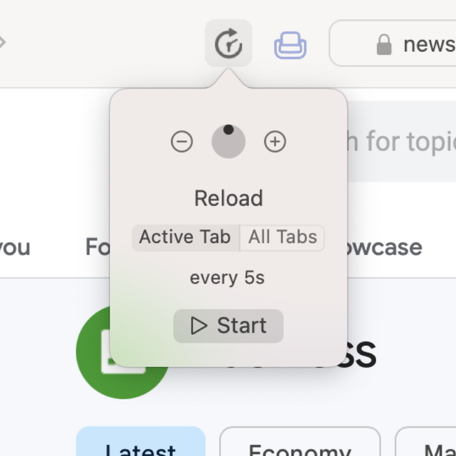

<h1>

Auto Reload
</h1>

Auto Reload is a Safari extension for automatically refreshing windows with recurring timers.

The main focus is providing said functionality with as few "add-on" side effects as possible.
There is no javascript, the interface is all native controls, and no additional permissions are required.
The extension ships in a basic Mac app with setup instructions.
The app is purely a wrapper and does not communicate with the extension.

Installation
------------

1. Download the [latest release](https://github.com/garrettrayj/auto-reload/releases/latest) from GitHub or purchase [Auto Reload on the Mac App Store](https://apps.apple.com/app/apple-store/id1437349439?pt=106763870&ct=GitHub&mt=8) to support development and receive automatic updates
2. Open the Auto Reload application
3. Open Safari then go to `Settings` > `Extensions`
4. Enable Auto Reload
5. Use the toolbar item to start/stop reloading windows

Support
-------

[Send an email](mailto:garrett@devsci.net) or create a GitHub issue for help. Suggestions and feedback are always welcome, no matter whether it's a message, review, or issue here.

-------------------------------------
Copyright &copy; 2024 Garrett Johnson
